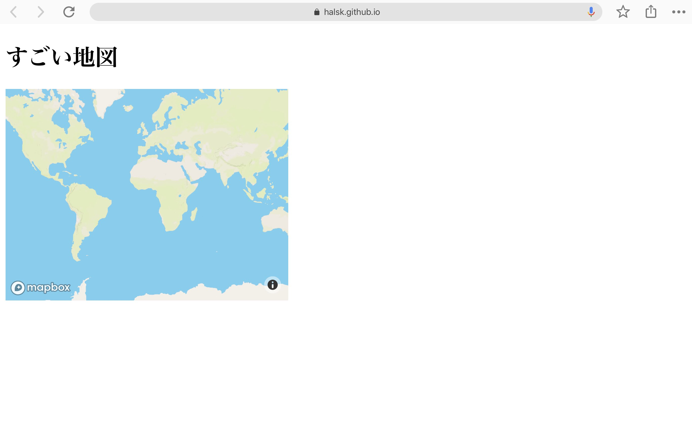

# 1. 早速地図を表示してみる

## Github に、コードを掲載する準備をする

https://github.com/new より、新たに リポジトリ(repository) を作成する

リポジトリ名（repository name）を mb-turorials （なんでも良い）として、あとはデフォルトのままで OK

[こちら](https://qiita.com/elu_jaune/items/eb354558d0dc39add152) を参考に、先程作ったリポジトリをローカル環境にclone(複製)する

## index.html を作る

Ctrl(CMD) + N を押し、新規ファイルを作成、index.html という名前で保存する。

## 最初のコードを書いてみる

まずはhtmlファイルを書いて公開してみましょう。先ほどの index.html に下記の内容をコピペして保存してから、github にPushしてみます

```html
<!DOCTYPE html>
<html>
  <head>
    <meta charset="utf-8">
    <title>My test page</title>
  </head>
  <body>
    <h1>すごい地図</h1>
  </body>
</html>
```

Github で、このhtmlをホストできるように設定しましょう。
リポジトリのページへ行き、Settings タブにある、GitHub Pages のコーナーで、source ブランチを master ブランチにします。
すると、

`Your site is published at (URL)`
 
と表示されると思います。URLにアクセスすると、上記のhtmlファイルが表示されます。（反映に少し時間がかかります。）
 
## Mapbox の地図を表示する
 
では、 いよいよ地図を表示します。
ログイン済みの状態で、[MapboxのGetting Started ページ](https://www.mapbox.com/install/)にアクセスすると、以下のように、利用するプラットフォームを選べます。


今回の場合はWebサイトで利用するので、JS(Web)を選びます。
`Select a method for installing Mapbox GL JS` では、Use the Mapbox CDNを選びましょう。（利用するJavaScriptをMapboxのCDNに置いておく方法です）

次のページで、以下のような2行のHTMLコードが表示されているはずです。それを、先ほど作ったindex.htmlファイルの`</head>`行の上にコピーペーストしましょう。

```html
<script src='https://static-assets.mapbox.com/gl-pricing/dist/mapbox-gl.js'></script>
<link href='https://api.mapbox.com/mapbox-gl-js/v0.53.0/mapbox-gl.css' rel='stylesheet' />
```

Next リンクをクリックすると、またコードが出てきます。今度は`</body>`行の上にコピーペーストします。

```html
<div id='map' style='width: 400px; height: 300px;'></div>
<script>
mapboxgl.accessToken = 'あなたのトークン';
var map = new mapboxgl.Map({
container: 'map',
style: 'mapbox://styles/mapbox/streets-v11'
});
</script>
```

上記の変更を、Github に反映(Push)させます。

しばらくしてから、再度 index.html を表示させ、以下のように地図が表示されれば成功です。



次：[スタイルを変更する](2_STYLES.md)へ