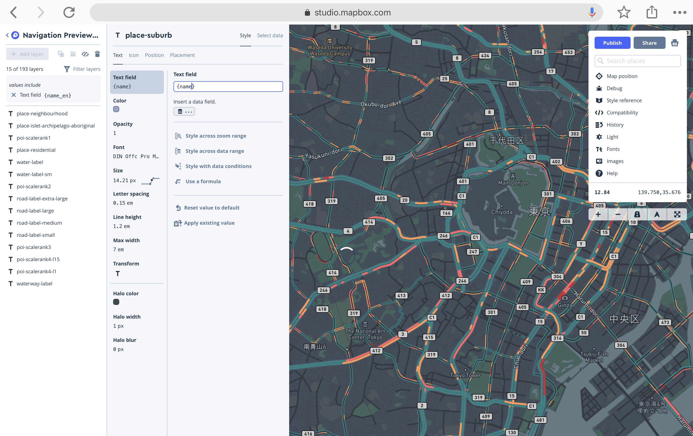
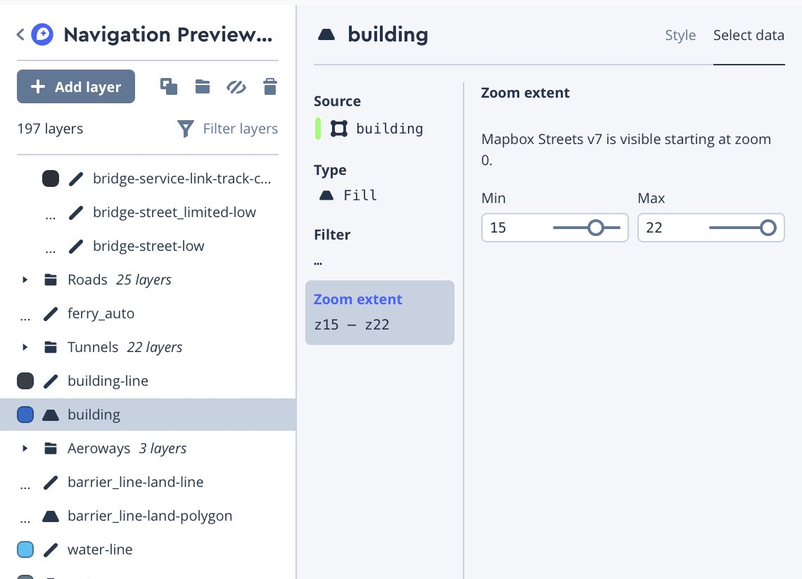

# 2. スタイルを変更する

地図のスタイルを自由に変更できるところが、Mapbox の大きな特徴です。スタイルを変更してみましょう。

[1. 地図を表示する](1_INSTALL.md)を実施してから行います

## 地図の表示領域を広げる

まずは、地図の大きさを広げましょう。index.html の中の、`<div id='map'` の部分が地図の領域なので、width と height を変更します。

`<div id='map' style='width: 100%; height: 600px;'></div>`

これで、地図が画面いっぱいに表示されるようになりました。

また、モバイルから表示された場合に最適化するため、`<title>`タグの上あたりに、viewport の指定をつけておきましょう。

```html
<meta name="viewport" content="width=device-width,initial-scale=1">
```

## カスタムスタイルを作る

Mapbox のデザインを変更する方法はいくつかありますが、このチュートリアルでは、Mapbox Studio を使います。ログインした状態で
[Mapbox Studio](https://studio.mapbox.com/) のページへアクセスします。

 

New Style を選択すると、元となるスタイルを選べます。好きな地図を選ぶと、マップスタイルの編集画面に移ります。今回は、`Navigation Preview Night` を選択します。


## 新しい地図を表示する

スタイルを編集する前に、先ほど作った地図を表示してみましょう。
スタイル一覧のページに戻り、Style URL をコピーします。


先ほどの index.html を開き、コピーした文字列（URI）で、 `style: 'mapbox://...'` の部分を差し替えます。
ブラウザからアクセスして、新しい地図のスタイルに変更されていれば成功です。

## デザインを変更する


### 表記を日本語に変更
デフォルトではラベル表記が英語なので、日本語表記に変更します。

変化がわかりやすいように、右側の地図を日本に移動しましょう。検索ボックス（Search Place）に東京を入力して移動できます。
スタイルの編集画面に移り、左側のパネルから、`Filter Layers` をつかい、`Filter by values` を選び、`{text fields}` を探します。
検索ボックスに name_en と入力すると、`Text field {name_en}` というフィルタが見つかるので、それを選択します。
すると、左側のスタイルが全てこの値を含んだものに絞り込まれます。それぞれを選択し、name_en の部分を name に変更します。



すべて変更したら Publish ボタンを押しましょう。

地図の中心点も、東京にしておきましょう。エディタ画面の地図内のボックス右下に、現在表示している場所の中心点の緯度経度が表示されていますので、これをコピーして、index.html の `style:..` 行に `center:[経度,緯度],` として設定します。
また、デフォルトの zoom レベルも、`zoom: レベル,` を追加することで変更できます。今回は12とします。
以下のようになるはずです。反映させて確認しましょう。

```html
var map = new mapboxgl.Map({
container: 'map',
center: [139.750,35.676],
zoom: 12,
style: 'mapbox://styles/georepublic/......'
});
```

地図が日本語表記に変わっていたら成功です。


## もっとデザインを変更する

左側のリストから、background、park、building などを選んで、色を変更してみましょう。デザインが変更できることがわかります。
満足いくスタイルができたら、再度 Publish ボタンを押せば、地図を変更することができます。

### もっと詳しく

地図のデザインのもととなるデータには、Line, Point, Polygon, Text など様々な種類があります。それぞれ、線、点、面、テキストの色を塗り分けることで地図を表現しています。
左側のリストにある、road_street は Line、park は Polygon、country-label-lg などは Text です。
これらの表示条件や色の設定、テキストのフォントや表示位置などを変更することで、地図のデザインを変更できます。

表示条件とは、例えばzoomレベルです。building のデータをみてみましょう。左側のリストから building を選択し、`Select data` 、`Zoom extent` を選ぶと、ズームレベルが15〜22の場合に表示されるようになっています。



また、`traffic-motorway-trunk` を選んでみてください。これは、交通量のデータです。color の所を選ぶと、`Data-driven function` となっていることがわかります。
動的に line color を変更しているのです。Json という形式で書かれており、以下のようになっています。

```json
{
  "base": 1,
  "type": "categorical",
  "property": "congestion",
  "stops": [
    [
      "low",
      "hsl(180, 56%, 33%)"
    ],
    [
      "moderate",
      "hsl(25, 100%, 66%)"
    ],
    [
      "heavy",
      "hsl(0, 100%, 70%)"
    ],
    [
      "severe",
      "hsl(0, 67%, 50%)"
    ]
  ],
  "default": "hsl(340, 57%, 37%)"
}
```

`Select data` タブを見てみると、`Mapbox Traffic V1` の traffic という Data source が使われているようです。その中に、congestion というプロパティがあり、stops に応じて色を変更していることがわかります。
（混雑している道を赤く表示しています）

## ナビゲーションコントロールや検索ボックスを追加する

ユーザビリティを向上するために、拡大・縮小のコントローラや、検索ボックスを追記してみましょう。
index.html を開き、`</script>`行の直前に以下の行を追記します。

```JavaScript
// Navigation Control
map.addControl(
 new mapboxgl.NavigationControl(), 'top-left'
);
// Geolocation Control
map.addControl(new mapboxgl.GeolocateControl({
  positionOptions: {
    enableHighAccuracy: true
  },
  trackUserLocation: true
}));
```

## 地図変更のその他の方法
Mapbox のテンプレートもさまざまなものがありますが、[Cartogram](https://apps.mapbox.com/cartogram/) というツールを使うと、写真などから色を指定して、好みの色の地図をつくることができます。

Mapbox Studio を使わなくても、上記のような指定をプログラミングで行うことができます。

* [Mapbox Studio のマニュアル](https://docs.mapbox.com/studio-manual/overview/)
* [その他の How to Video](https://www.mapbox.com/videos/)

[オリジナルのデータを追加する](3_DATASET.md)