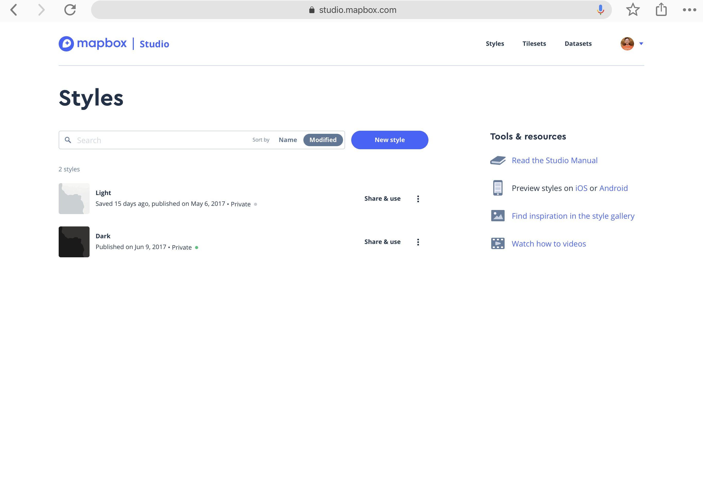
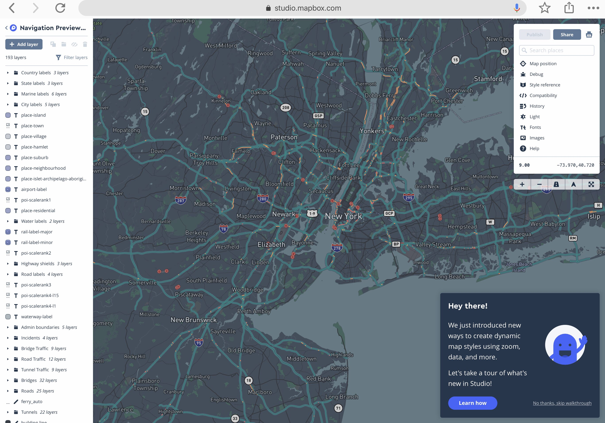
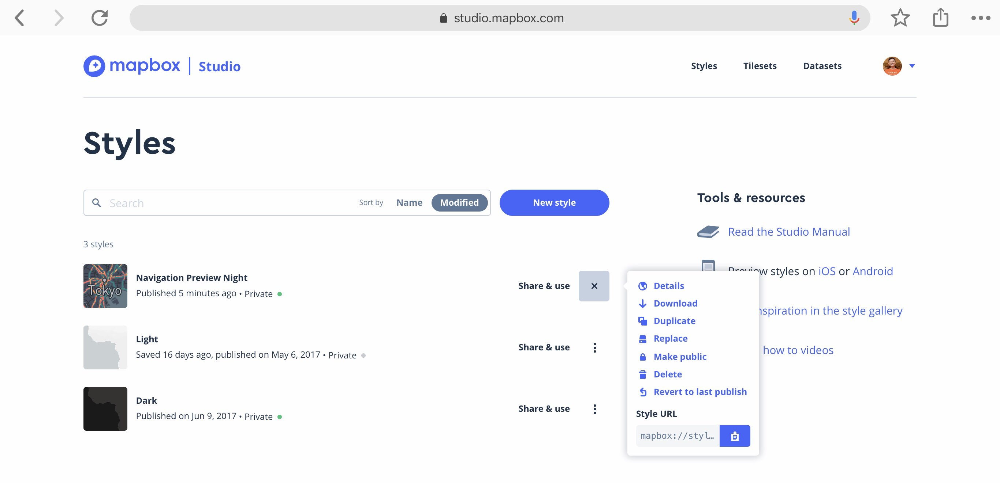

# 2. スタイルを変更する

地図のスタイルを自由に変更できるところが、Mapbox の大きな特徴です。スタイルを変更してみましょう。

[1. 地図を表示する](1_INSTALL.md)を実施してから行います

## 地図の表示領域を広げる

まずは、地図の大きさを広げましょう。index.html の中の、`

`

これで、少し地図が大きくなりました。

## カスタムスタイルを作る

Mapbox のデザインを変更する方法はいくつかありますが、このチュートリアルでは、Mapbox Studio を使います。ログインした状態で
[Mapbox Studio](https://studio.mapbox.com/) のページへアクセスします。

 

New Style を選択すると、元となるスタイルを選べます。好きな地図を選ぶと、マップスタイルの編集画面に移ります。

## 新しい地図を表示する

スタイルを編集する前に、先ほど作った地図を表示してみましょう。
スタイル一覧のページに戻り、Style URL をコピーします。

先ほどの index.html を開き、コピーした文字列（URI）で、 `style: 'mapbox://...'` の部分を差し替えます。
