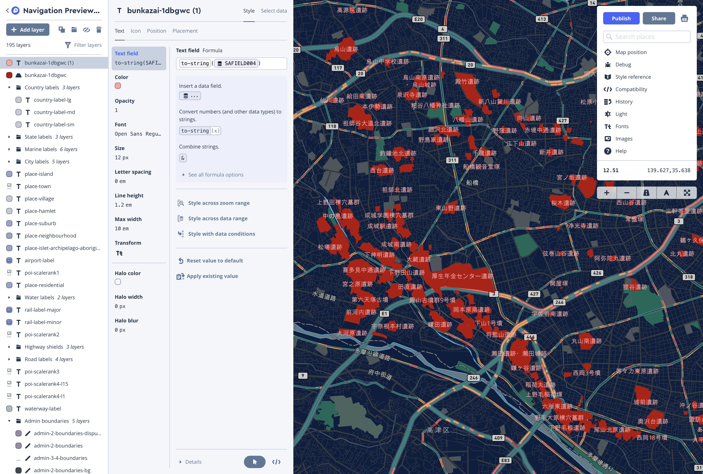
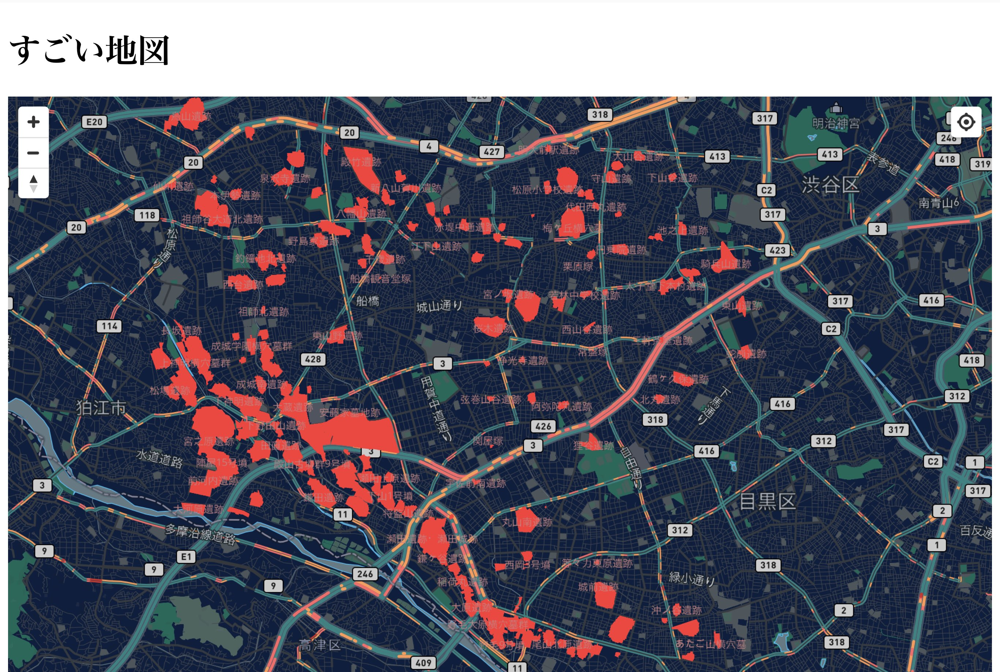
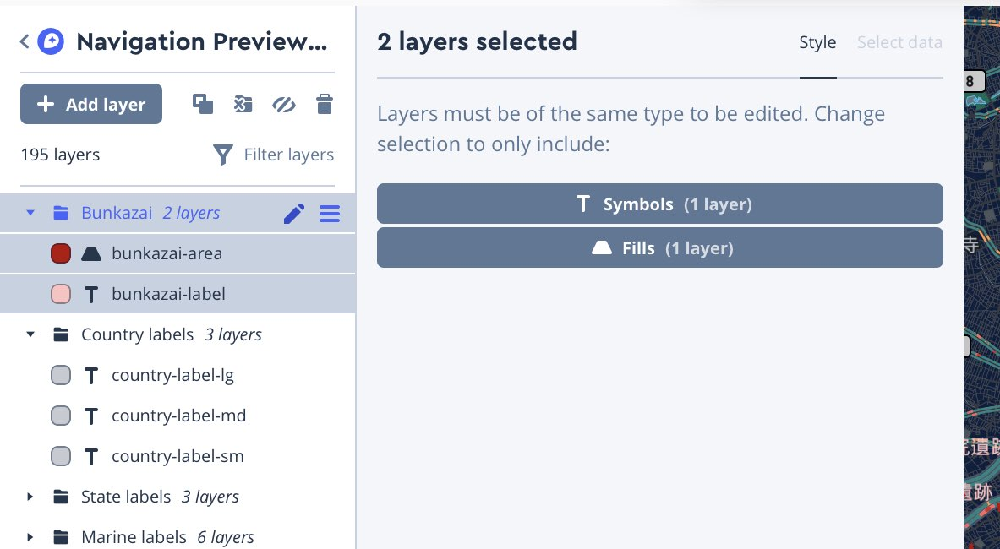
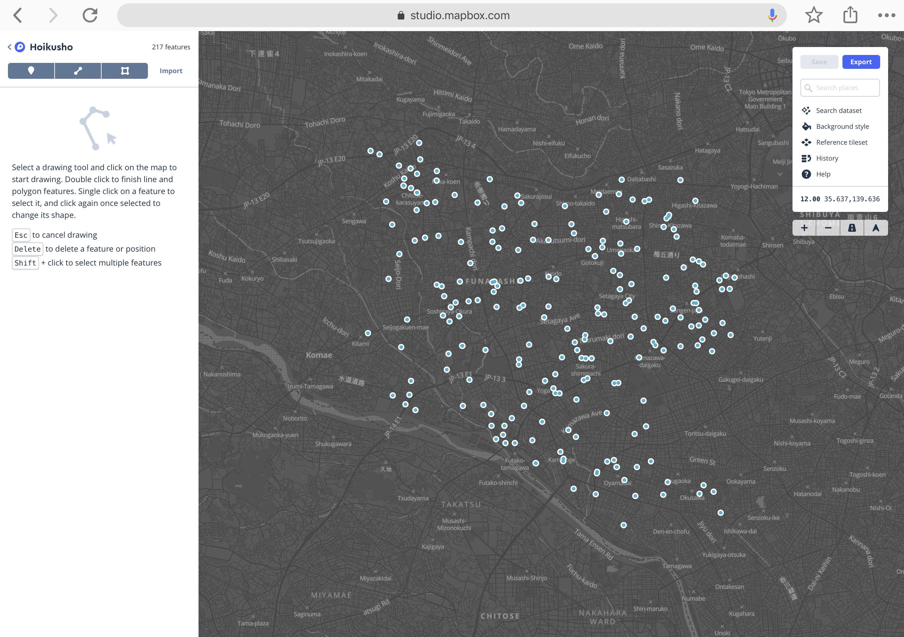
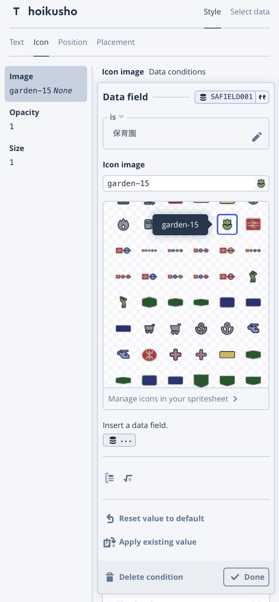
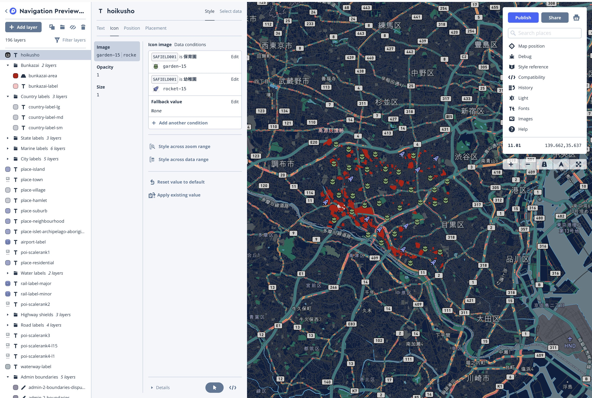
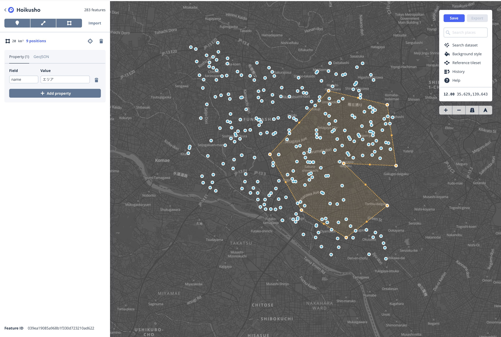
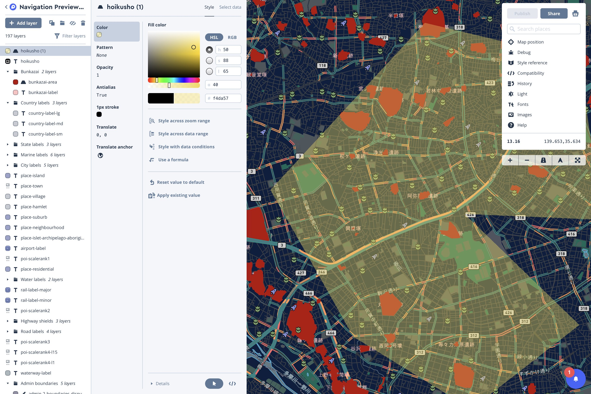

# オリジナルデータを登録する

いよいよ、自分で用意したデータを登録してみましょう。
[Dataset Editor](https://studio.mapbox.com/datasets/) から、データを登録できます。

Mapbox Studio から登録できるデータには、データセット(dataset) と、 タイルセット(tileset) という形式があります。

データセットからは、Point, Line, Polygon といったデータや属性(property)へアクセスでき、 共にMapbox Studio dataset editor や Datasets API 経由で編集をすることができます。

タイルセットは、ベクター形式の軽量なデータ集合で、高速な描画に最適化されています。読み取り専用で、Mapbox Studio 上からは編集できません。
この、タイルセットの機能が、Google Maps などと Mapbox が大きく違う点です。Google Maps で GeoJson などのカスタムデータを表示する場合、データの転送やクライアントでの処理が発生するため、表示させるデータ量が大きくなった場合に描画に時間がかかってしまいます。
それに対し、Mapbox のタイルセットはベクタータイル（Vector Tiles）という仕組みを使っているために、その時表示している範囲のデータのみをクライアントに転送することができ、軽量です。

更に詳細な比較については、[Mapboxのドキュメント](https://docs.mapbox.com/help/troubleshooting/uploads/)を見てください

## タイルセットを作る

オリジナルのデータを Mapbox Studio 上で表示するために、新たにタイルセット(tileset)を作ります。
タイルセットには、様々な地理空間情報が指定できますが、今回は[世田谷区GISオープンデータ](http://data-setagaya.opendata.arcgis.com/)にあるデータから、[埋蔵文化財包蔵地](http://data-setagaya.opendata.arcgis.com/datasets/%E5%9F%8B%E8%94%B5%E6%96%87%E5%8C%96%E8%B2%A1%E5%8C%85%E8%94%B5%E5%9C%B0)を表示してみましょう。

ダウンロード→シェープファイル を選択すると、シェープファイルが含まれたzipファイルをダウンロードできます。シェープファイル(Shapefile)とは、地理空間情報のフォーマットの一つで、ESRI社などの主要な地理情報ソフトウェアで使われるフォーマットです。
日本語ファイル名をタイルセットに登録すると文字化けするので、ダウンロードしたファイルの名前を Bunkazai.zip に変更します。

[Mapbox tilset editor](https://studio.mapbox.com/tilesets/)から `New tileset` を選択し、 Bunkazai.zip をアップロードします。
アップロードが完了すると、Mapbox Studio から登録したデータを使うことができます。

[Mapbox Studio](https://studio.mapbox.com/)から、作成中の地図を開き、左側のメニューから`+ Add layer` を選択すると、先程登録した Bunkazai という tileset を選べるようになっているはずです。
Bunkazai の下にあるデータを選択したのち、Style タブに切り替えると、描画色を変更することができます。

Shapefile には、ポリゴン以外の属性データも登録されています。各フィールドの詳細については、[データセットのページ](http://data-setagaya.opendata.arcgis.com/datasets/%E5%9F%8B%E8%94%B5%E6%96%87%E5%8C%96%E8%B2%A1%E5%8C%85%E8%94%B5%E5%9C%B0/data)で確認できます。ここでは、遺跡名称を地図上に表示してみましょう。タイルセット上では、SAFIELD004 として登録されています。

再度`Add layer` を行い、Bunkazai tileset を選択します。次に、現在 `Fill` となっている `Type` を、`Symbol` に変更すると、テキスト表記ができます。Style タブを開き、`Text field` の内容を設定します。`Insert a data field` から、属性として登録されている内容を選ぶことができますので、SAFIELD004 を選びます。

また、Color や Size を選択して、読みやすいスタイルに変更します。

合わせて、index.html を編集し、中心点の緯度経度も世田谷区にしておきましょう。(139.646,35.626)

一通り設定したら、Publish ボタンを押し、ブラウザ側で確認してみます。

先程作ったタイルセットが表示されれば完了です

2つのレイヤーを管理しやすいように、グループを新しく作りまとめておくと良いでしょう

## データセットを作る

地理情報を含んだデータをアップロードすることで、dataset を作成できます。
今回は保育所のデータセットを作ってみます。[保育所データ](http://data-setagaya.opendata.arcgis.com/datasets/%E4%BF%9D%E8%82%B2%E6%89%80)のページから、ダウンロード→スプレッドシートを選択すると、csvファイルをダウンロードできます。
データに含まれる緯度経度情報を指定するために、ダウンロードしたデータを一度テキストエディットで開いて、1行目の X,Y, の部分をLongitude, Latitude, に変更して保存します。

その後、[Mapbox Studio dataset editor](https://studio.mapbox.com/datasets/)から、先ほど作った csv ファイルをアップロードします。アップロードが完了したら、データセットの名前を入力(Hoikusho)して Confirm を押し、編集画面に移動します。

続いて、[幼稚園データ](http://data-setagaya.opendata.arcgis.com/datasets/%E5%B9%BC%E7%A8%9A%E5%9C%92)もダウンロードして、X,Y, を変更した後に、編集画面から import をします。これで、保育園と幼稚園の場所が含まれるデータセットができました。

## データセットをタイルセットに変換する

データセットをスタイルエディタ上で表示するためには、データセットをタイルセットに変換する必要があります。データセットの一覧画面に戻り、該当データセットのメニューから、`Export to tileset` を選択します。ポップアップウィンドウでは、`Export to a new tileset` を選択します。

## スタイルエディタから編集する

文化財の時と同じく、新規レイヤーから Hoikusho tileset が選択できるようになりました。

元が Point データなので、デフォルトのままだと円でデータが表示される設定になっています。今回は、保育園と幼稚園でアイコンを出し分けてみましょう。（ダウンロードしたCSVファイルを見ると、名称の次に「保育園」か「幼稚園」が入っていることがわかります。）`Style` タブに移り、`Icon` タイプを選択します。ここで好きなアイコンを選ぶこともできますが、今回はデータの内容に応じてアイコンを変更しますので、`Style with data conditions` を選択します。次の画面では、データ項目として SAFIELD001 を選択します。データの条件設定画面が出ますので、"is" 保育園 を選び、表示されているアイコンの中から好きなものを選びます。（オリジナルのアイコンを登録することもできます。）

終わったら `Done` ボタンを押し、`Add another condition` を選択、今度は"is" 幼稚園 を選び、別の種類のアイコンを選択します。すると、2つの条件にあったアイコンが出し分けられていることがわかります。

Publish ボタンを押し、反映を確認しましょう

## データセットを編集してみる

データセットエディタは、データのインポートだけでなく、独自のデータ作成なども可能です。

データセットページから Hoikusho データセットを選び、既存の点をドラッグして移動したり、プロパティを変更してみましょう。
また、ポリゴンボタンなどから、新たにデータを追加することができます。ポリゴンを追加して、name プロパティを追加してみましょう。

一通り編集が終わったら、一覧画面に戻り、データセットからタイルセットを更新します。今度は、`Update a connected datasets`を選び、既存のタイルセットを更新します。

改めてスタイルエディタに移動してみると、変更が反映されていると思います。
新しく追加したポリゴンデータも、`Add a layer` から Hoikusho タイルセットを選び、 Fill タイプに変更すれば表示できます。

これで再度Publishをして先ほどの index.html を表示してみると、新しく追加したポリゴンも表示されるはずです（反映されるまで少し時間がかかる場合があります）

[サンプルHTMLはこちら](index2.html)

[4. インタラクティブな機能をつける](./4_INTERACTIVE.md)に続きます